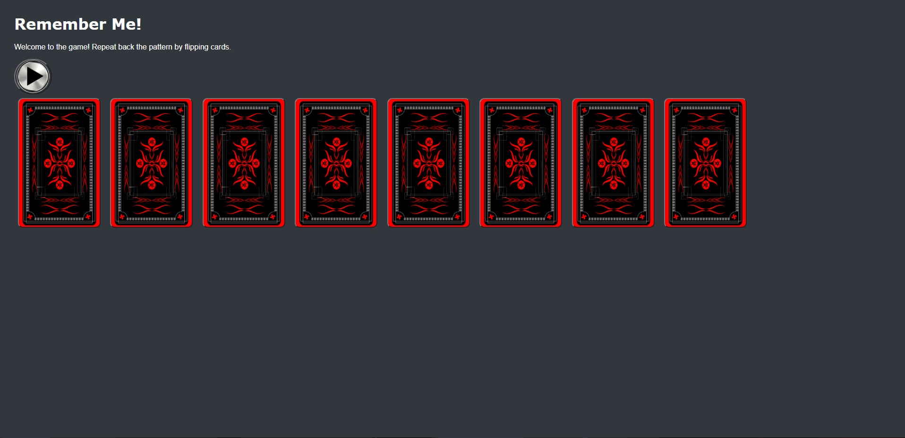

# Pre-work - *Memory Game*

**Memory Game** is a Light & Sound Memory game to apply for CodePath's SITE Program. 

Submitted by: **Joey Blount**

Time spent: **4.5** hours spent in total

Link to project: https://remember-me-prework.glitch.me/

## Required Functionality

The following **required** functionality is complete:

* [x] Game interface has a heading (h1 tag), a line of body text (p tag), and four buttons that match the demo app
* [x] "Start" button toggles between "Start" and "Stop" when clicked. 
* [x] Game buttons each light up and play a sound when clicked. 
* [x] Computer plays back sequence of clues including sound and visual cue for each button
* [x] Play progresses to the next turn (the user gets the next step in the pattern) after a correct guess. 
* [x] User wins the game after guessing a complete pattern
* [x] User loses the game after an incorrect guess

The following **optional** features are implemented:

* [x] Any HTML page elements (including game buttons) has been styled differently than in the tutorial
* [x] Buttons use a pitch (frequency) other than the ones in the tutorial
* [x] More than 4 functional game buttons
* [x] Playback speeds up on each turn
* [x] Computer picks a different pattern each time the game is played
* [x] Player only loses after 3 mistakes (instead of on the first mistake)
* [x] Game button appearance change goes beyond color (e.g. add an image)
* [x] Game button sound is more complex than a single tone (e.g. an audio file, a chord, a sequence of multiple tones)
* [ ] User has a limited amount of time to enter their guess on each turn

The following **additional** features are implemented:

- [x] List anything else that you can get done to improve the app!
* [ ] Replace colors on cards to card faces.
* [ ] Add flip animation to cards.
* [ ] add timer for each turn and dispaly it
* [ ] make background and text founds more complex

## Video Walkthrough (GIF)

If you recorded multiple GIFs for all the implemented features, you can add them here:

## Reflection Questions
1. If you used any outside resources to help complete your submission (websites, books, people, etc) list them here. 
[StackOverFlow, Grepper, W3Schools]

2. What was a challenge you encountered in creating this submission (be specific)? How did you overcome it? (recommended 200 - 400 words) 
[The main challenge I overcame was learning syntax and various different html and css features. Since this is my first time dealing with css, JS, and html, I had to learn everything as I went. During the required steps it was fairly simple still because there was plenty of documentation and code provided to get where I needed to be, but after I started working on optional features, I had to teach myself Syntax and elements of all three languages as I coded. One of the things in specific I ran into troubles with was css syntax on putting in pictures. I found a couple different sources on stack overflow and Grepper using either CSS or img tags in html and the CSS one seemed like the best option. After I settled on an option for coding the image in I had issues linking the image to the code well. I soon realized I should just download the image and put it into a background remover. then put that image into assets folder to get link. Then came the CSS settings for it. Being new to CSS, the thing I struggle with most is understanding how to format each block. In general the visual aspects of this project where the most challenging since all my coding experience is in more technical programing in languages like Java and Python.

3. What questions about web development do you have after completing your submission? (recommended 100 - 300 words) 
[I am still very new to web development languages and still don't understand allot of css and html concepts very well. My main question about web developement is how to efficiently design and execute a project. During this project I just followed the steps provided and went through implementing feature by feature. A big thing that I am hoping to learn is how to design a website both functionally and visually. My memory game project, I will admit, is not very pleasing to the eye, and looks less proffessional than I would have hoped.]

4. If you had a few more hours to work on this project, what would you spend them doing (for example: refactoring certain functions, adding additional features, etc). Be specific. (recommended 100 - 300 words) 
[If I had more time on this project I would have worked more on the last optional feature being the timer. I spent a little time on it and kept getting stuck because my knowledge in JS and html is still very limited, but if I had more time, I would try to learn more of the basics and try to figure it out. One thing I wanted to do was to turn the simon says them into a playing card memorization game where the bottom of the cards were actual faces that were "shuffled" at the start of every game. I also wanted to add more of a "flip" animation as you click the cards, but expected that to take way too much time given my current knowledge to pull off. If i had more time I would also mess around with the layout of the page. I kept my layout pretty similar to original exept for resizing the tiles, but I feel like more could be done with the layout.]

## Interview Recording URL Link

[My 5-minute Interview Recording](https://www.loom.com/share/0a4564ebc1be4333aac9452ab3a94552?sharedAppSource=personal_library)

## License

    Copyright [Joey Blount]

    Licensed under the Apache License, Version 2.0 (the "License");
    you may not use this file except in compliance with the License.
    You may obtain a copy of the License at

        http://www.apache.org/licenses/LICENSE-2.0

    Unless required by applicable law or agreed to in writing, software
    distributed under the License is distributed on an "AS IS" BASIS,
    WITHOUT WARRANTIES OR CONDITIONS OF ANY KIND, either express or implied.
    See the License for the specific language governing permissions and
    limitations under the License.