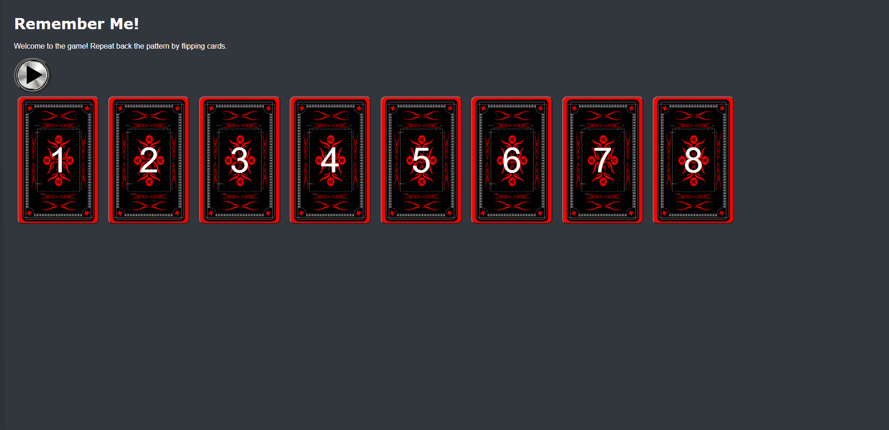
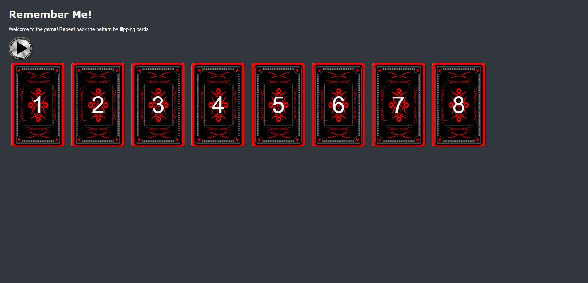

# Pre-work - *Memory Game*

**Memory Game** is a Light & Sound Memory game to apply for CodePath's SITE Program. 

Submitted by: **Joey Blount**

Time spent: **6.5** hours spent in total

Link to project: https://remember-me-prework.glitch.me/

## Required Functionality

The following **required** functionality is complete:

* [x] Game interface has a heading (h1 tag), a line of body text (p tag), and four buttons that match the demo app
* [x] "Start" button toggles between "Start" and "Stop" when clicked. 
* [x] Game buttons each light up and play a sound when clicked. 
* [x] Computer plays back sequence of clues including sound and visual cue for each button
* [x] Play progresses to the next turn (the user gets the next step in the pattern) after a correct guess. 
* [x] User wins the game after guessing a complete pattern
* [x] User loses the game after an incorrect guess

The following **optional** features are implemented:

* [x] Any HTML page elements (including game buttons) has been styled differently than in the tutorial
* [x] Buttons use a pitch (frequency) other than the ones in the tutorial
* [x] More than 4 functional game buttons
* [x] Playback speeds up on each turn
* [x] Computer picks a different pattern each time the game is played
* [x] Player only loses after 3 mistakes (instead of on the first mistake)
* [x] Game button appearance change goes beyond color (e.g. add an image)
* [x] Game button sound is more complex than a single tone (e.g. an audio file, a chord, a sequence of multiple tones)
* [x] User has a limited amount of time to enter their guess on each turn

The following **additional** features are implemented:

- [x] List anything else that you can get done to improve the app!
* [x] Added numbers to the tiles to make the game easier when using long sequences
* [x] Added pointer cursor to clickable areas on game

## Video Walkthrough (GIF)

If you recorded multiple GIFs for all the implemented features, you can add them here:

## Reflection Questions
1. If you used any outside resources to help complete your submission (websites, books, people, etc) list them here. 
[StackOverFlow, Grepper, W3Schools]

2. What was a challenge you encountered in creating this submission (be specific)? How did you overcome it? (recommended 200 - 400 words) 
[The main challenge I overcame was learning syntax and various different html and CSS features. Since this is my first time dealing with CSS, JS, and HTML, I had to learn everything as I went. The required steps were fairly straightforward because there was plenty of documentation and code provided to get where I needed to be, but after I started working on optional features, I had to teach myself Syntax and elements of all three languages as I coded. One of the things in specific I ran into troubles with was CSS syntax on putting in pictures. I found a couple of different sources on stack overflow and Grepper using either CSS or IMG tags in HTML and the CSS one seemed like the best option. After I settled on an option for coding the image in I had issues linking the image to the code well. I soon realized I should just download the image and put it into a background remover. then put that image into the assets folder to get a link. Then came the CSS settings for it. Being new to CSS, the thing I struggle with most is understanding how to format each block. One other thing I struggled with a little bit was the timer feature. I first tried using the setInterval and clearInterval as shown in prework info, but couldn't understand it very well at first so I tried making a function that used recursion and setTimeout, but that had issues when implementing it into the game logic. I tried asking on the web dev slack, but no response so I took a fresh take at the feature the next day and I managed to understand get and setInterval a lot better and made it work. In general, I try to work through my problems a bit before I seek help since I don't want to use up someone else's time, but if something causes me to get stuck for long periods of time I would try to seek out help more to make myself more efficient and productive. In general, the visual aspects of this project were the most challenging since all my coding experience is in more technical programming in languages like Java and Python, but some JS features are still fairly different and new from what I currently know.]

3. What questions about web development do you have after completing your submission? (recommended 100 - 300 words) 
[I am still very new to web development languages and still don't understand allot of CSS and HTML concepts very well. My main question about web development is how to efficiently design and execute a project. During this project, I just followed the steps provided and went through implementing feature by feature. A big thing that I am hoping to learn is how to design a website both functionally and visually. I still lack experience in professionally designing programs and am hoping to learn strategies to create functional and well-designed web programs.]

4. If you had a few more hours to work on this project, what would you spend them doing (for example: refactoring certain functions, adding additional features, etc). Be specific. (recommended 100 - 300 words) 
[If I had more time on this project I would have worked on better options for the play stop button, I feel there might have been better-looking options for the button that would have fit the program better. I also would implement a difficulty option for it using a button before the start of the game. The button would allow for larger sets of sequences making the game longer, and possibly shorter time between turns and fewer mistakes allowed. One other thing I would try to do is think of some designs to make the background look a little bit more complex and fill some of the space.]

## Interview Recording URL Link

[My 5-minute Interview Recording](https://www.loom.com/share/0a4564ebc1be4333aac9452ab3a94552?sharedAppSource=personal_library)

## License

    Copyright [Joey Blount]

    Licensed under the Apache License, Version 2.0 (the "License");
    you may not use this file except in compliance with the License.
    You may obtain a copy of the License at

        http://www.apache.org/licenses/LICENSE-2.0

    Unless required by applicable law or agreed to in writing, software
    distributed under the License is distributed on an "AS IS" BASIS,
    WITHOUT WARRANTIES OR CONDITIONS OF ANY KIND, either express or implied.
    See the License for the specific language governing permissions and
    limitations under the License.